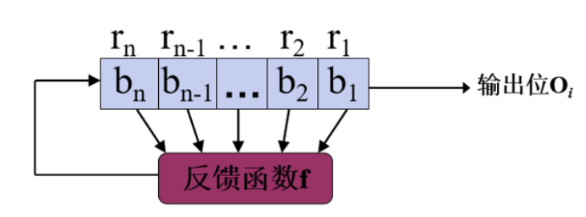

- 序列密码通常认为起源于上个世纪20年代的维尔姆(Vernam)密码
- 序列密码又称为流密码，属于对称密码
- 序列密码是世界各国的军事和外交等重要领域中使用的主要密码体制之一

## 解析表达

$$\begin{align}
    C=P\oplus K\\
    C\oplus K = P\oplus K \oplus K = P
\end{align}$$

在序列密码中，将明文消息按一定长度(长度较小，譬如1个比特)分组，然后对各组用“随机”的**密钥序列**进行加密，产生相应的密文。解密用相同的密钥序列对密文序列进行分组解密以恢复出明文序列

- 明文为$p=p_0p_1p_2\dots$
- 密钥为$k=k_0k_1k_2\dots$
- 设密文为$c=c_0c_1c_2\dots$
- 则加密变换为$c_i=E_{ki}(p_i)$
- 则解密变换为$p_i=D_{ki}(c_i)$

> 加解密只是简单的异或运算 
> 密码安全强度主要依赖**密钥序列的安全性**

## 密钥序列产生器基本要求

1. 初始密钥K足够长，一般应该在128位以上
2. 密钥序列产生器KG生成的密钥序列$\{k_i\}$应该具有**极大周期**
3. 密钥序列$\{k_i\}$具有均匀的n-元分布，即在一个周期内，某特定形式的n-长bit串与其求反，两者出现的频数大抵相当
4. 雪崩效应。即种子密钥K任一位的改变要引起密钥序列$\{k_i\}$在全貌上的变化
5. 密钥序列$\{k_i\}$**不可预测**的。密文及相应的明文的部分信息(确定部分密钥序列)，不能确定整个密钥序列$\{k_i\}$

## 反馈移位寄存器

反馈移位寄存器是由n位的寄存器和反馈函数，n位的寄存器中的初始值称为移位寄存器的**初态**

