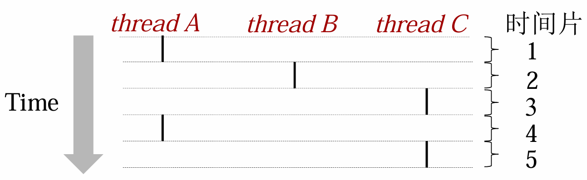

## 线程引入

现在有一情形：数据库服务器如何同时处理来自多个客户端的数据查询请求，这些请求都是针对同一数据库的数据的

解决方法：

1. 设置**一个进程顺序处理**所有请求；
2. 设置**多个进程分别处理**多个请求；

存在的问题：

1. 进程同步复杂
2. 进程切换的系统开销大

### 线程概念

定义

- 线程是进程内一个相对独立的**可调度的执行单元**

线程属性

1. 轻型实体：TCB+堆栈+一组寄存器
2. 独立调度和分派的基本单位
3. 可并发执行
4. 共享线程资源
5. 线程有生命周期，在生命其中有状态变化

线程基本状态

- 就绪态
- 运行态
- 阻塞态

#### 传统概念下的进程

进程 = 进程上下文+ code,data,and stack

#### 另一种角度的进程

进程 = 线程 + code, data, and kernel context

1. **基本的CPU执行单元**
2. 并**不单独拥有系统资源**，只拥有其在运行中必不可少的资源，如线程ID、程序计数器、寄存器集合和堆栈
3. 但**同一进程下的不同线程共享进程拥有的全部资源**
4. 也有**就绪、阻塞、运行**三种状态

### 单线程进程与多线程进程


### 多线程与进程的关系

一个进程可以关联多个线程

1. 每个线程有着自己的控制流 
2. 属于同一个进程下的线程**共享所属进程的地址空间**
3. 每个线程有着自己的**局部变量的堆栈**（但对于其他线程来说并不是被保护的）
4. 每个线程有着自己的**线程id** (thread ID, TID)

> 建立进程的概念是为了**保护独立的地址空间**<br>
> 而建立线程的概念是为了**更好地支持并发**(线程切换的开销更小)

### 主线程

- 每个进程都是作为一个单一线程启动的，也被称为**主线程**
- 在之后的某个时间点，主线程创建了对等线程，然后两个线程并发的执行
- 并发线程执行

### 线程池

**与进程关联的线程**形成一个线程池，并不像进程一样有一个树状的继承关系

{width=400}

### 并发线程

在**时间线上控制流有重叠**的线程是并发的



> 上图中：A线程与B线程、A线程与C线程并发，B线程与C线程顺序执行

## 多线程模型

### 并发线程的执行

- 单核处理器通过时间片模拟执行
- 多核处理器可以实现真正的并行


### 线程支持

- 用户层的用户级线程
    - 用户级线程位于内核之上，它的管理**无需内核支持**
- 内核层的内核级线程
    - 内核级线程由**操作系统**来直接支持与管理

#### 用户级线程与内核级线程的关系

- 多对一模型
- 一对一模型
- 多对多模型

## Posix线程

POSIX简介链接 [https://linux.cn/article-14201-1.html](https://linux.cn/article-14201-1.html)

与其说 POSIX 是一个东西，不如说是一个标签。想象一下，有一个盒子，上面贴着标签：POSIX，而盒子里是一个标准。该标准由 POSIX 所关注的**规则和指令集**组成。

POSIX 是可移植操作系统接口(Portable Operating System Interface)的缩写，其定义了应用程序（以及命令行 Shell 和实用程序接口）和 UNIX 操作系统之间的**语言接口**

Pthreads 约60个函数的标准接口，这些函数可操纵C程序中的线程

### 创建线程

`int pthread_create(pthread_t* tid, pthread_attr_t* attr, func* f, void* arg)`

- 当一个程序创建了多个线程以后，其在多核机和单核机上面运行会产生不同效果
- 多线程的执行速度并不一定比顺序执行快（如在单核机上运行时）

```c
void* task(void* ID) {
    long id = (long) ID;
    printf("Task %ld started\n", id);
    
    int i;
    double result = 0.0;
    for (i = 0; i < 10000000; i++) {
        result = result + sin(i) * tan(i);
    }
    
    printf("Task %ld completed with result %e\n", id, result);
}

void* print_usage(int argc, char* argv[]) {
    printf("Usage: %s serial|parallel num_tasks\n", argv[0]);
    exit(1);
}

// 并行执行
void* parallel(int num_tasks) {
    int num_threads = num_tasks;
    pthread_t thread[num_threads];
    int rc;
    long t;
    
    for (t = 0; t < num_threads; t++) {
        printf("Creating thread %ld\n", t);
        rc = pthread_create(&thread[t], NULL, task, (void*)t);
        if (rc) {
            printf("ERROR: return code from pthread_create() is %d\n", rc);
            exit(-1);
        }
    }
}

// 顺序执行
void* serial(int num_tasks) {
    long i;
    for (i = 0; i < num_tasks; i++) {
        task((void*)i);
    }
}

int main(int argc, char* argv[]) {
    if (argc != 3) { 
        print_usage(argc, argv); 
    }

    int num_tasks = atoi(argv[2]);

    if (!strcmp(argv[1], "serial")) {
        serial(num_tasks);
    } else if (!strcmp(argv[1], "parallel")) {
        parallel(num_tasks);
    } else {
        print_usage(argc, argv);
    }

    printf("Main completed\n");
    pthread_exit(NULL);
}
```

#### 向线程传递参数

`pthread_create()`允许程序员将一个参数传递给线程并启动例程。

对于必须**传递多个参数**的情况，可以创建一个**包含所有参数的结构体**，然后在`pthread_create()`中传递一个**指向该结构体的指针**，可克服此限制

> 所有参数必须通过引用传递并强制转换为`(void *)`

### 终止线程

`void pthread_exit(void* thread_return)`

- 当比他更高一级的进程返回时线程**隐式终止**；
- 当调用`pthread_exit`时线程**显式终止**；
- 如果主线程调用了`pthread_exit`，会等待所有其他线程终止后终止主线程，整个进程将`thread_return`作为返回值；
- 当调用`exit`时，**整个进程**都会被终止。

`int pthread_cancel(pthread_t tid`

- 调用`pthread_cancel`并**不等于线程终止**，它只提出请求。线程在取消请求发出后会继续运行；
- 直到到达某个**取消点**。取消点是线程检查是否被取消并按照请求进行动作的一个位置

```c
// 线程终止与取消实例
void *PrintHello(void *threadid) 
{
    long tid;
    tid = (long)threadid;
    printf("Hello World! It's me, thread #%ld!\n", tid);
    pthread_exit(NULL);
}

int main(int argc, char *argv[]){
    pthread_t threads[NUM_THREADS]; /* NUM_THREADS = 5 */
    long taskids[NUM_THREADS];
    int rc;
    long t;
    for(t = 0; t < NUM_THREADS; t++) {
        printf("In main: creating thread %ld\n", t);
        rc = pthread_create(&threads[t], NULL, PrintHello, taskids + t);
        if (rc) {
            printf("ERROR; return code from pthread_create() is %d\n", rc);
            exit(-1);
        }
    }
    /* Last thing that main() should do */
    pthread_exit(NULL);
}

```

### 结合/分离线程

一个线程的结束有两种途径，一种是函数结束，调用它的线程也就结束，另一种方式是通过函数`pthread_exit`来实现

`pthread`有两种状态`joinable`状态(默认)和`unjoinable`状态。如果线程是`joinable`状态，当
线程函数自己返回退出时或`pthread_exit`时都不会释放线程所占用堆栈和线程描述符。

只有调用了`pthread_join`之后这些资源才会被释放。若是`unjoinable`状态的线程，这些资源在线程函数退出时或`pthread_exit`时自动会被释放

`int pthread_join(pthread_t tid, void** thread_return)`

- 连接是线程之间同步的一种方法
- pthread_join 阻塞线程直到tid线程终止
- 与linux中的`wait`函数不同，`pthread_join`函数可以只等候特定的线程终止
- 一个线程只能响应一个`pthread_join()`请求。对同一个线程尝试多个`join`操作会发生逻辑错误

`int pthread_detach(pthread_t tid)`

- `pthread_detach` 函数将线程tid分离出来
- 默认情况下，线程创建时为可连接的 
- 每个可连接线程应由另一个线程显式获取，或通过调用`pthread_detach`函数来分离。