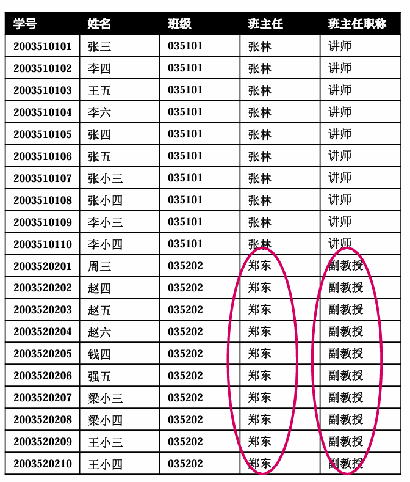

## 实体联系设计问题

- 冗余
- 非受控冗余

- 受控冗余：比如Table中的外键（继承其他Table的键值）
- 插入异常：比如当一名新同学入学时，尚未指定系，则因系的有关信息不完整，便无法输入到数据库中
- 删除异常：当四系所有同学被删除后，则四系的有关信息则随之丢失

## 物理数据库设计

- 设计用户视图及访问控制规则，以进行安全性控制
- 建立索引
- 设计使数据库运行达到最佳效率的一些措施
- 设计备份Backup和恢复Recovery的步骤