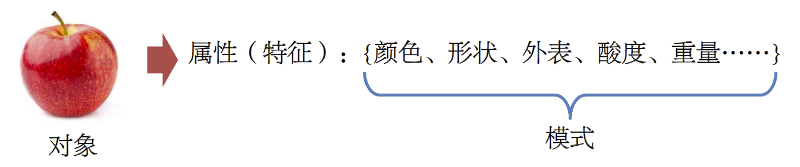
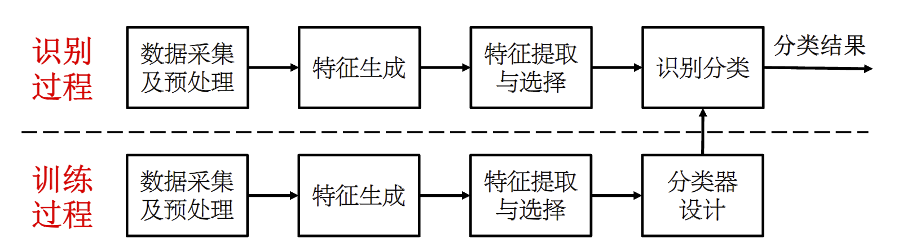

## 模式与识别

- 模式：待识别对象的一组**属性集合** 

{width=500px}

- 识别：根据模式判断不同对象是否属于同类或属于哪种类别

{width=500px}

## 一个完整的模式识别系统

> 预处理包含处理缺失值和离群点，数据标准化等等

## 识别分类

根据训练样本有无类别标号，模式识别方法可以分为有监督学习（分类）与无监督学习（聚类）

分类器两大类：判别式模型和产生式模型

- 判别式模型：样本模式确定地处在特征空间不同的区域，通过训练得到类别边界
- 产生式模型：样本模式是特征空间的随机变量，估计概率密度以确定类别属性