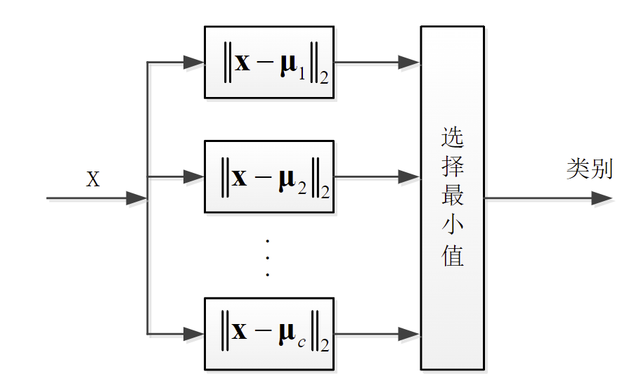
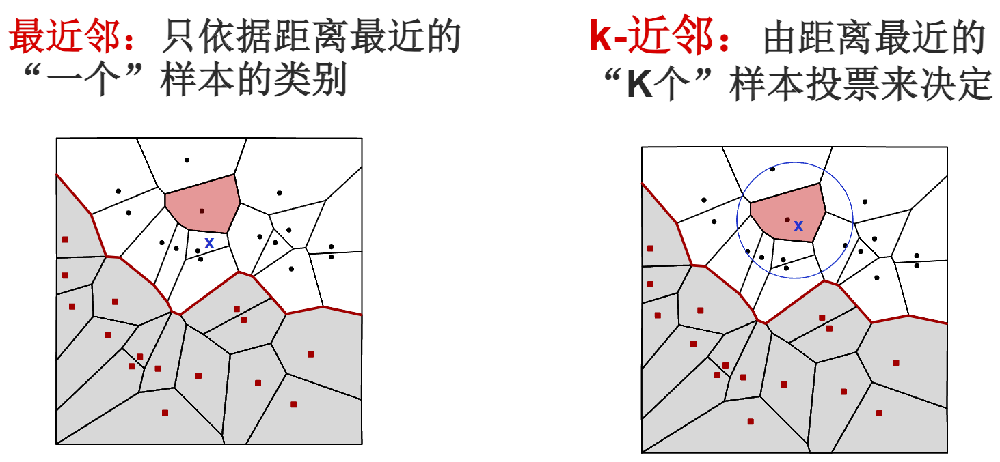

## 概述

识别对象与某个类别是否相似是人在做出识别判断时的一个基本依据

## 一般形式

- 输入：识别样本$\vec{x}$
- 计算：$\vec{x}$与所有类别的相似度$s(\vec{x},\omega_i),i=1,2,\dots, c$
- 输出：相似度最大的类别$\omega_j$

$$j=\argmin_{1\leq i\leq c}s(\vec{x},\omega_i)$$

## 模板匹配

每个类别的先验知识就是一个模板$\mu_i$

利用$x$与模板$\mu_i$的相似度作为$x$与类别$\omega_i$的相似度

用**距离**作为度量样本之间的相似度

$$s(\vec{x},\mu)=-d(\vec{x},\mu)=-||\vec{x}-\mu||_2$$

> 其中$||\cdot||_2$为矢量的$l_2$范数，差矢量$\vec{x}-\mu$的$l_2$范数就是两个点之间的欧氏距离

{width=400}

## 最近邻分类器

每一个类别有多个训练样本$D_i=\{\vec{x_1^{(i)}},\dots,\vec{x_{n_i}^{(i)}}\}$

> 类别$i=1,\dots, c$为第i类训练样本个数

样本与类别$\omega_i$之间相似程度为

$$s(\vec{x},\omega_i)=-\min_{\vec{y}\in D_i} d(\vec{x},\vec{y})$$

输入：需要识别的样本$\vec{x}$，训练样本集$D=\{x_1,\dots, x_n\}$

寻找$D$中与$\vec{x}$距离最近的样本$\vec{y}=\argmin_{x_i\in D} d(\vec{x},\vec{x_i})$

### 特点分析

- 训练样本数量较多时，效果良好
- 计算量大：需要计算$n$个样本的距离，时间复杂度为$O(n^2)$
- 容易受噪声影响：样本集中存在噪声时，分类结果可能不准确
- 占用存储空间大

### 最近邻分类的加速

转化为单模板匹配，用每个类别的训练样本学习出一个**最具有代表性的**模板

如何学习出来一个最有代表性的模板？

选择距离训练样本都比较近的点

那么模板可以在d维的欧氏空间通过一个优化问题求解

$$\mu_i=\argmin_{\mu\in R^d}\sum_{k=1}^{n_i}D(x_k^{(i)},\mu)$$

令$J_i(\mu)=\sum_{k=1}^{n_i}||x_k^{(i)}-\mu||_2=\sum_{k=1}^{n_i}(x_k^{(i)}-\mu)^T(x_k^{(i)}-\mu)$

优化求解问题为$\mu_i=\argmin_{\mu\in R^d}J_i(\mu)$

$J_i(\mu)$的极值点是其使得梯度为0的矢量

$$\nabla J_i(\mu)=\frac{\partial J_i(\mu)}{\partial \mu}=\sum_{k=1}^{n_i}2(x_k^{(i)}-\mu)(-1)=0$$

最终得到极值点就是第i类训练样本的均值

## K-近邻分类器

算法实现：

1. 初始化距离为最大值
2. 计算未知样本与每个训练样本的距离dist
3. 得到**目前k个最近邻样本中**的最大距离maxdist
4. 若dist小于maxdist，则将该训练样本作为K-最近邻样本
5. 重复步骤2-4，直到所有未知样本和所有训练样本的距离都计算完
6. 统计K-最近邻样本中每个类标号出现的次数
7. 选择出现次数最多的类标号作为分类结果

## 距离度量

任何一个定义在两个矢量上的函数$d(x,y)$，只要满足如下4个性质就可以乘坐距离度量

1. 非负性
2. 对称性
3. 自反性
4. 三角不等式

常见的距离度量函数：

1. 欧氏距离：$d(x,y)=||x-y||_2=\sqrt{\sum_{i=1}^n(x_i-y_i)^2}$
2. 曼哈顿距离：$d(x,y)=\sum_{i=1}^n|x_i-y_i|$（也叫做街市距离）
3. 切比雪夫距离：$d(x,y)=\max_{1\leq i\leq n}|x_i-y_i|$

闵可夫斯基距离

$$d(\vec{x},\vec{y})=\left[\sum_{i=1}^{n}|x_i-y_i|^q\right]^{\frac{1}{q}}$$

马氏距离

$$D(x,y)=\sqrt{(\vec{x}-\vec{y})^T(\vec{x}-\vec{y})}$$

> 其中$C=\frac{1}{n-1}\sum_{i=1}^{n}\left((x_i-\bar{x})(y_i-\bar{y})\right)^T$为多维特征协方差矩阵，如果各维特征独立同分布，那么马氏距离就是欧氏距离

## 样本规格化

特征量纲会导致计算结果的不同，比如两个特征量纲不同的特征，其距离度量值会有很大的差别

所以使用样本规格化：使样本的每一维特征都分布在相同的范围内，计算距离度量时每一维特征上的差异都会得到相同的体现

### 缩放方式

1. 均匀缩放：假设每一维特征都服从均匀分布，将每一维特征平移和缩放到 [0,1]内
2. 高斯缩放：假设每一维特征都服从高斯分布，将每一维特征平移和缩放到标准正态分布

### 相似性度量

衡量相似度不一定需要距离，在某些情况下可以选择更直接的方法衡量相似度

- 角度相似性（两向量的夹角）
- 相关系数(数据中心化（移除均值）后矢量夹角的余弦)

相似性度量随着样本间相似程度的增加而增大，距离则是随着相似程度的增加而减小。为了保持一致性可以将相似度和距离进行转换，如$s(x,y)=-D(x,y)$