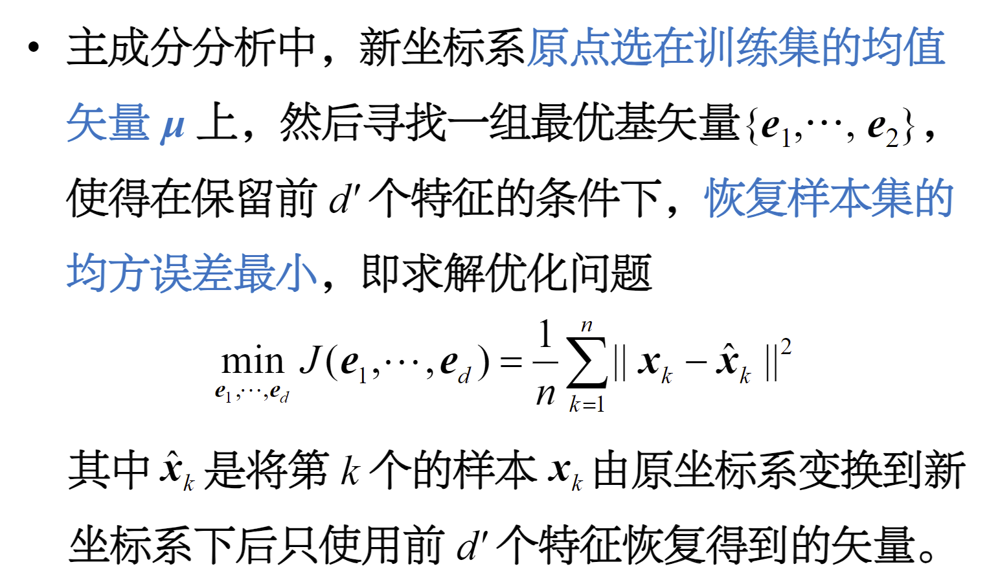
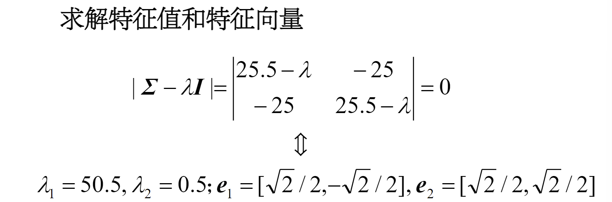
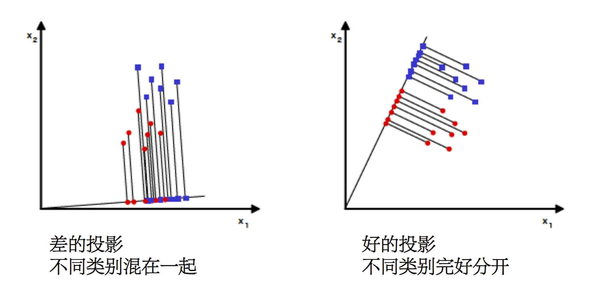

## 特征提取

特征选择：从原始的d维数据中选择d'个特征使得某种类别可分性判据最优

特征提取：将原始特征经过某种变换$y_i=f_i(x)$得到可极大限度保留原特征信息的少量新特征

## 主成分分析(PCA)

主要思想：寻找到数据的**主轴方向**，由主轴构成一个新的坐标系，然后数据由原坐标向新坐标系**投影**

> 直角坐标系下，矢量可以表示为基矢量的线性组合

新坐标系下，矢量x'的元素可以由原坐标系下的矢量$\vec{x}$和$\mu$和基矢量计算得到

$$a_i=e_i^T(x-\mu)\quad i=1,2,\dots,d$$

如果只选择$d'<d$个特征，然后用保留的特征恢复原坐标系下的d维特征矢量

$$\hat{x}=\mu+\sum_{i=1}^{d'}a_ie_i$$

显然存在误差，误差大小与新坐标的位置、基矢量的方向以及保留的特征有关

### 寻找最优基矢量

用$a_{ki}$表示第k个样本在新坐标系下第i维的特征，可得$x_k-\hat{x_k}=\sum_{i=d'+1}^da_{ki}e_i$

优化问题变为

$$\begin{align}
    \min_{e_1,\dots,e_d}J(e_1,\dots,e_d)=\frac{1}{n}\sum_{k=1}^n||\sum_{i=d'+1}^da_{ki}e_i||^2\\
    =\frac{1}{n}\sum_{k=1}^n\sum_{i=d'+1}^d a_{ki}^2\\
\end{align}$$

又因为$a_{ki}=e^T(x_k-\mu)=[e_i^T(x_k-\mu)]^T$

得到

$$\begin{align}
    \min_{e_1,\dots,e_d}J(e_1,\dots,e_d)=\sum_{i=d'+1}^{d}e_i^T\left[\frac{1}{n}\sum_{k=1}^n(x_k-\mu)(x_k-\mu)^T\right]e_i\\
    =\sum_{i=d'+1}^{d}e_i^T\Sigma e_i
\end{align}$$

> 约束为$||e_i||^2=1,i=1,2,\dots,d$

> 使得$\Sigma e_i=\lambda_ie_i$成立的$\lambda_i$与$e_i$分别为$\Sigma$的**特征值**与**特征向量**

如果希望将一个样本集 D 的维度在新坐标下降低，可以将新坐标系原点放在样本集 D 均值位置，以集合 D 的协方差矩阵的特征矢量作为基矢量，可以保证只用保留的 dʹ 维特征恢复原矢量的时候均方误差最小

### 主成分分析算法

1. 输入：样本集合D，计算均值矢量$\mu$，协方差矩阵$\Sigma$
2. 计算协方差矩阵的特征值和特征向量，按照特征值由大到小排序
3. 选择前d'个特征矢量作为列矢量构成矩阵$E=(e_1\quad e_2\quad \cdots\quad e_d')$
4. d维特征矢量$\vec{x}$可以转换为d'维特征矢量$\vec{x}'$
5. 由降维后的矢量$\vec{x}'$恢复原始量x

$$\hat{x}=Ex'+\mu$$

### 示例

<figure markdown>
{width=450px}

{width=450px}

{width=450px}
</figure>

### 分析

- 协方差矩阵 Σ 是实对称阵，其特征值为实数，其特征矢量正交。即，特征矢量构成一组正交基，主成分分析得到的新坐标系是一个**直角坐标系**

- 几何理解：特征值越大，说明矩阵在对应特征向量上的**方差越大**，样本点越分散，越容易区分，**信息量也就越多**

- 主成分分析时**应该保留多少特征**？

主成分分析用 dʹ 个新特征表示原始的 d 维特征引起的误差是$J=\sum_{i=d'+1}^d\lambda_i$，舍弃的特征值越少则误差越小

<figure markdown>
{width=350px}
</figure>

<figure markdown>
{width=400px}
</figure>

## 基于Fisher准则的可分性分析(FDA)

是在可分性最大意义下的最优线性映射，充分保留了样本的类别可分性信息

### 确定分类最优的投影方向

假设两类问题的样本集为$D_1=\{x_1^{(1)},\dots,x_{n_1}^{(1)}\}$和$D_2=\{x_1^{(2)},\dots,x_{n_2}^{(2)}\}$，投影直线的单位矢量为$w$,

那么d维空间矢量x在这条直线上投影为标量:

$$y=w^Tx$$

两类原始矢量样本集在投影后变味了两个标量集

$$D_1\to Y_1=\{y_1^{(1)},\dots,y_{n_1}^{(1)}\},\quad D_2\to Y_2=\{y_1^{(2)},\dots,y_{n_2}^{(2)}\}$$

用两类样本的**均值之差**$(\tilde{\mu_1}-\tilde{\mu_2})^2$度量两类样本之间的**分散程度**，用两类样本各自的方差之和$\tilde{s_1}^2+\tilde{s_2}^2$度量两类样本内的**离散程度**，可定义Fisher准则

$$J(w)=\frac{\tilde{\mu_1}-\tilde{\mu_2}}{\tilde{s_1}^2+\tilde{s_2}^2}$$

> Fisher准则越大，则类别可分性越强

### $J(w)$关于$w$的显示表达式

- 投影后类别均值

$$\tilde{\mu_i}-\frac{1}{n}\sum_{y\in Y_i}y=\frac{1}{n}\sum_{x\in D_i}w^Tx=w^T\mu_i$$

- 投影后均值之差的平方可以表示为

$$(\tilde{\mu_1}-\tilde{\mu_2})^2=(w^T\mu_1-w^T\mu_2)^2=w^T(\mu_1-\mu_2)(\mu_1-\mu_2)^Tw=w^TS_b w$$

> $S_b$是**类间散布矩阵**

- 投影后类内样本方差为

$$\tilde{s_i}^2=\sum_{y\in Y_i}(y-\tilde{\mu_i})^2=\sum_{x\in D_i}(w^Tx-w^T\mu_i)^2=w^TS_i w$$

> $S_i$是第i类的**类内散布矩阵**

- 两类样本的方差之和为

$$\tilde{s_1}^2+\tilde{s_2}^2=w^TS_1w+w^TS_2w=w^TS_w w$$

因此，Fisher准则函数表示为

$$J(w)=\frac{(\tilde{\mu_1}-\tilde{\mu_2})^2}{\tilde{s_1}^2+\tilde{s_2}^2}=\frac{w^TS_b w}{w^TS_w w}$$

> 以上称为Rayleigh商优化问题，可以适当调整w使得Fisher准则的分母$w^TS_w w$为一常数值C，可以得到一个**有约束的优化问题**

### 可分性分析算法

### 分析

- 经FDA变换后，新的坐标系不正交；$S_w^{-1}S_b$不是对称矩阵，特征矢量不具正交性，变换后特征之间仍具有一定相关性。
- 当样本数足够多时，才能够保证类内散度矩阵 $S_w$为非奇异矩阵（存在逆矩阵）；样本数少时，$S_w$可能是奇异矩阵（此时可用奇异值分解求解）。
- $S_w^{-1}S_b$最多只存在c ‒ 1个特征值大于0，FDA后，新坐标维数最多为c ‒ 1，c为类别数。
