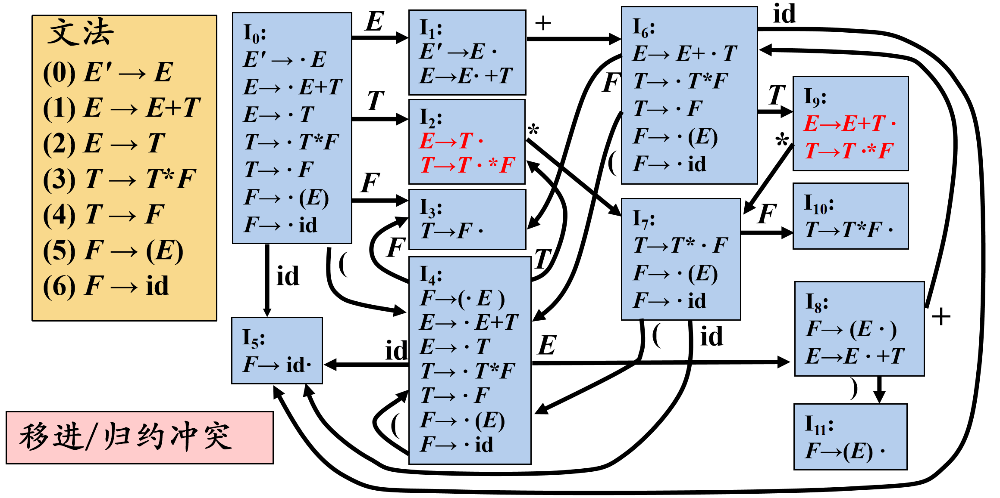

## LR(0)项目

右部某位置标有圆点的产生式称为相应文法的一个**LR(0)项目**

$$A\to \alpha_1\cdot\alpha_2$$

例：有产生式$S\to bBB$

$$\begin{cases}
    S\to \cdot bBB (移进项目)\\
    S\to b\cdot BB (待约项目)\\
    S\to bB\cdot B (待约项目)\\
    S\to bBB\cdot  (归约项目)\\
\end{cases}$$

> 项目描述了句柄识别的状态 
> 产生式$A→ε$只生成一个项目$A→ ·$ 

### 增广文法

如果$G$是一个以$S$为开始符号的文法，则$G$的增广文法$G'$就是在$G$中加上新开始符号$S'$和产生式$S'→S$而得到的文法

引入这个新的开始产生式的目的是**使得文法开始符号仅出现在一个产生式的左边**，从而使得分析器只有一个接受状态

#### 后继项目

**同属于一个产生式**的项目，但圆点的位置只**相差一个符号**，则称后者是前者的**后继项目**

比如：$A\to\alpha\cdot X\beta$的后继项目是$A\to \alpha X\cdot \beta$

> 可以把等价的项目组成一个项目集$I$ ，称为**项目集闭包**(Closure of Item Sets)，**每个项目集闭包对应着自动机的一个状态**

### CLOUSURE函数

### GOTO函数

### 状态集构建

### LR(0)分析过程中的冲突

