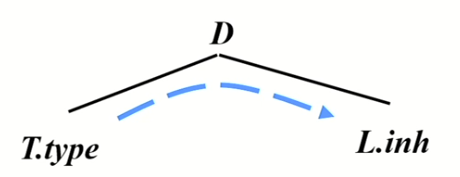
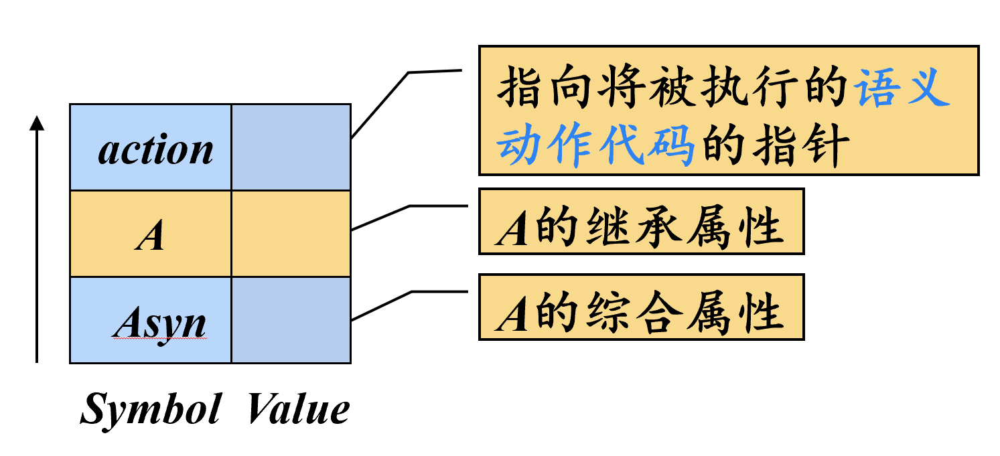
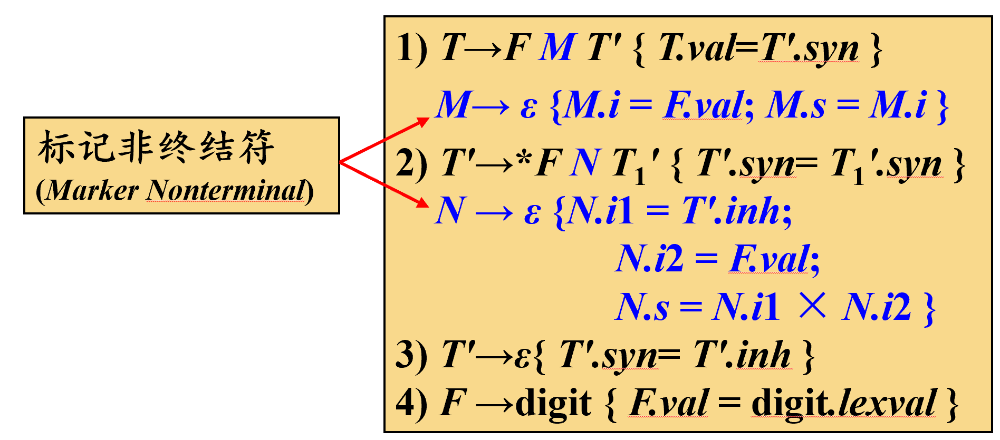
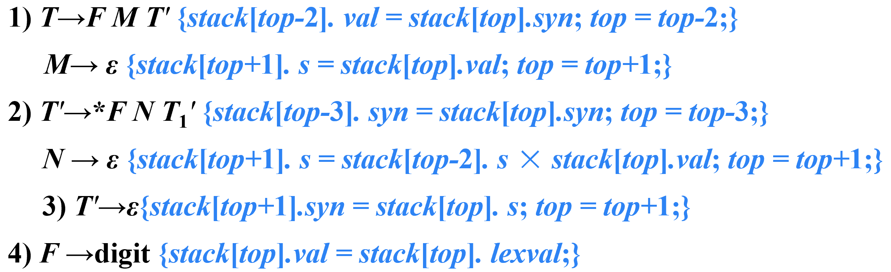

## 句法制导定义SDD

- 句法制导定义SDD是对CFG的推广
    - 将每个**文法符号**和一个**语义属性集合**相关联
    - 将每个**产生式**和一组**语义规则**相关联，用来计算该产生式中各文法符号的属性值

### 综合属性

在分析树结点N上的非终结符A的综合属性只能通过**N的子结点**或**N本身**的属性值来定义

> 终结符可以具有综合属性。终结符的综合属性值是由**词法分析器**提供的**词法值**，因此在SDD中没有计算终结符属性值的语义规则

### 继承属性

在分析树结点N上的非终结符A的继承属性只能通过**N的父节点**、**N的兄弟节点**、**N本身的属性值**来定义

例：

|产生式|语义规则|
|----|----|
|D→TL|L.inh = T.type|

> 规定终结符没有继承属性，终结符从词法分析器获得的属性值被归为**综合属性值**

## 属性文法

一个没有副作用的SDD有时也称为**属性文法**

属性文法的规则仅仅通过其它属性值和常量来定义一个属性值

## SDD的求值顺序

### 属性值的求值顺序

可行的求值顺序是满足下列条件的$N_1,N_2,...,N_k$：若依赖图中有一条从$N_i$到$N_j$的边，那么$i<j$

这样的排序将一个有向图变成了一个线性排序，这个排序称为这个图的**拓扑排序**(topological sort)

对于**只具有综合属性**的SDD ，可以**按照任何自底向上的顺序**计算它们的值

对于同时具有**继承属性**和综合属性的SDD，**不能保证**存在一个顺序来对各个节点上的属性进行求值

从计算的角度看，给定一个SDD，很难确定是否存在某棵句法分析树，使得SDD的属性之间存在循环依赖关系。幸运的是，存在一个SDD的有用子类，它们能够保证对每棵句法分析树都存在一个求值顺序，因为它们不允许产生带有环的依赖图。不仅如此，有两类SDD可以和自顶向下及自底向上的句法分析过程一起高效地实现:L-SDD和S-SDD。

### L-SDD与S-SDD

- S-SDD(Simple-SDD)
    - 仅仅使用综合属性的SDD称为S属性的SDD
- L-SDD(Left-SDD)
    - 一个属性定义是L-SDD，当且仅当它的每个属性要么是一个综合属性，要么是满足如下条件的继承属性：假设存在一个产生式$A→X_1X_2…X_n$，其右部符号$X_i$ (1 ≤ i ≤ n)的继承属性仅依赖于下列属性：
        - A的**继承属性**（不能是综合属性，直接根除了子结点与根结点之间的依赖形成环路的可能）
        - 产生式中$X_i$左边的符号$X_1, X_2, … , X_{i-1}$的属性
        - $X_i$**本身的属性**，但$X_i$的全部属性不能在依赖图中形成环路

> L-SDD的直观理解：在一个产生式所关联的各属性之间，依赖图的边可以**从左到右**，但不能从右到左

## 句法制导翻译方案SDT

定义：句法制导翻译方案(SDT)是在产生式右部中嵌入了程序片段(称为**语义动作**)的CFG

此处关注如何使用SDT实现上述两种SDD

1. 基本文法可以使用LR分析技术，且SDD是S属性的
2. 基本文法可以使用LL分析技术，且SDD是L属性的

### SDD转换为SDT

- S-SDD
    - 将每个语义动作都放在产生式最后

如果一个S-SDD的基本文法可以使用LR分析技术，那么它的SDT可以在LR句法分析过程中实现

- L-SDD
    - 对于综合属性，将其放在产生式最后
    - 对于某个非终结符A的继承属性的动作插入到产生式右部中紧靠在A的本次出现之前的位置上

如果一个L-SDD的基本文法可以使用LL分析技术，那么它的SDT可以在LL或LR句法分析过程中实现

## 在非递归的预测分析过程中进行翻译

### 扩展句法分析栈

> A的**继承属性**放在A本身的记录当中；由于A的**综合属性**产生的时间不同，所以放在Asyn中；此外还有记录**语义动作代码**的指针

- **综合属性出栈**时，要将综合属性值复制给后面特定的语义动作（如果有需要）
- 变量展开时（即**变量本身的记录出栈**时），如果其含有**继承属性**，则要将继承属性值**复制给后面特定的语义动作**（位于即将扩展的产生式右部）

## L-属性定义的自底向上翻译

给定一个以LL文法为基础的L-SDD，可以修改这个文法，并在LR句法分析过程中计算这个新文法之上的SDD

### 具体步骤

- 首先构造SDT，在各个非终结符之前放置语义动作来计算它的继承属性， 并在产生式后端放置语义动作计算综合属性
- 对每个内嵌的语义动作，向文法中引入一个**标记非终结符**(例如M)来替换它。每个这样的位置都有一个不同的标记，并且对于任意一个标记$M$都有一个产生式$M→ε$
- 如果标记非终结符M在某个产生式$A→α\{a\}β$中替换了语义动作$a$，对$a$进行修改得到$a'$ ，并且将$a'$关联到$M→ε$上。

语义动作$a'$需要：

1. 将动作$a$需要的A或α中符号的任何属性**作为M的继承属性进行复制**
2. 按照$a$中的方法**计算各个属性**，但是将计算得到的这些属性作为M的**综合属性**

### 举例

使用标记非终结符**替换内嵌的语义动作**

> 最终目的是让所有的语义动作都位于**产生式末尾**

将语义动作转化为可执行的**栈操作**

