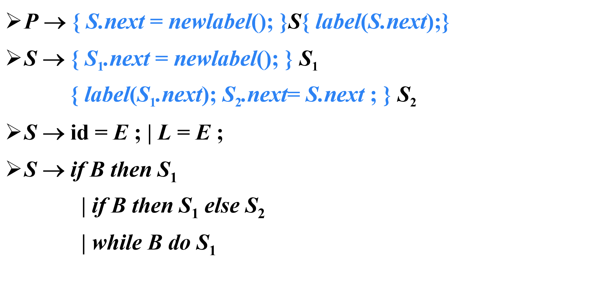
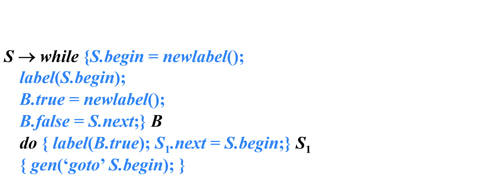

## 简单赋值语句的翻译


> 赋值翻译的主要任务：生成对表达式求值的**三地址码**

### 赋值语句的SDT


例：


{width=400}
{width=400}

## 数组引用的翻译

{width=400}

> 将数组引用翻译成三地址码要解决的主要问题是确定数组**元素的存放地址**

### 数组元素寻址

- 一维数组：假设每个数组元素的宽度是w，那么数组元素a[i]的相对地址是$base + i \times w$

其中$base$是基地址，$i\times w$是偏移地址

- k维数组

数组元素$a[i_1][i_2]\dots[i_k]$的相对地址是

$$base+i_1\times w_1+i_2\times w_2+\dots+i_k\times w_k$$

> $w_k\to a[i_1][i_2]\dots[i_k]$的宽度

## 控制流语句的翻译



### if-then语句


### if-then-else语句


### while-do语句



## 布尔表达式的基本文法


> 在跳转代码中，逻辑运算符&&、|| 和 ! 被翻译成**跳转指令**。运算符本身不出现在代码中，布尔表达式的值是通过代码序列中的位置来表示的

例：

```c
if(x<100|| x>200 && x!=y){
    x=0;
}
```

```
    if x<100 goto L2
    goto L3
L3: if x> 200 goto L4
    goto L1
L4: if x!=y goto L2
    goto L1
L2: x=0
L1:
```

### 布尔表达式的SDT


## 布尔表达式的回填

### 回填

生成一个跳转指令时，暂时不指定该跳转指令的**目标标号**。这样的指令都被放入由跳转指令组成的列表中。**同一个列表中的所有跳转指令具有相同的目标标号**。等到 能够确定正确的目标标号时，才去填充这些指令的目标标号

### 非终结符B的综合属性

- `B.truelist`：指向一个包含跳转指令的列表，这些指令最终获得的目标标号就是当B为真时控制流应该转向的指令的标号
- `B.falselist`：指向一个包含跳转指令的列表，这些指令最终获得的目标标号就是当B为假时控制流应该转向的指令的标号

### 函数

`makelist( i )`
创建一个只包含i的列表，i是跳转指令的标号，函数返回指向新创建的列表的指针

`merge( p1, p2 )`
将 p1 和 p2 指向的列表进行合并，返回指向合并后的列表的指针

`backpatch( p, i )`
将 i 作为目标标号插入到 p所指列表中的各指令中

例：$B\to E_1 relop E_2$

```
{
    B.truelist = makelist(nextquad);
    B.falselist = makelist(nextquad+1);
    gen('if' E1.addr relop E2.addr 'goto_');
    gen('goto_');
}
```

例：$B\to B_1 or B_2$

1. $B\to B_1 or M B_2$

```
{
    backpatch(B_1.falselist, M.quad);
    B.truelist = merge(B_1.truelist, B_2.truelist)
    B.falselist = B_2.falselist;
}
```

2. $M\to\epsilon$

```
{
    M.quad = nextquad;
}
```
