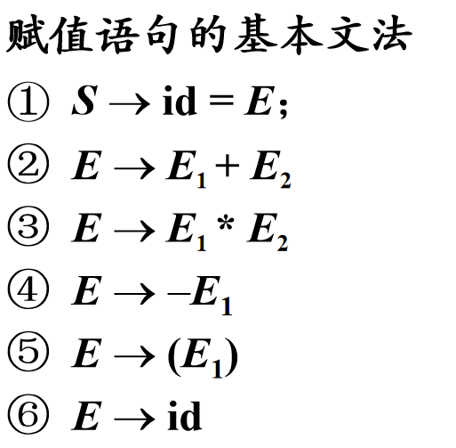
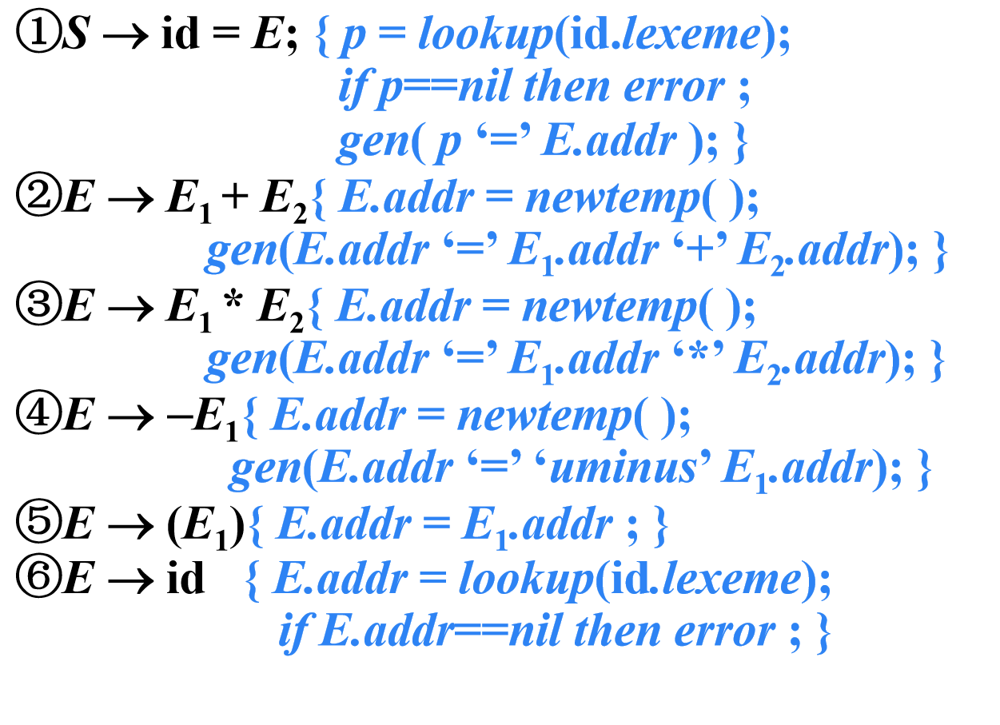

## 简单赋值语句的翻译

> 赋值翻译的主要任务：生成对表达式求值的**三地址码**

### 赋值语句的SDT

例：

{width=400}
{width=400}

## 数组引用的翻译

{width=400}

> 将数组引用翻译成三地址码要解决的主要问题是确定数组**元素的存放地址**

### 数组元素寻址

- 一维数组：假设每个数组元素的宽度是w，那么数组元素a[i]的相对地址是$base + i \times w$

其中$base$是基地址，$i\times w$是偏移地址

- k维数组

数组元素$a[i_1][i_2]\dots[i_k]$的相对地址是

$$base+i_1\times w_1+i_2\times w_2+\dots+i_k\times w_k$$

> $w_k\to a[i_1][i_2]\dots[i_k]$的宽度