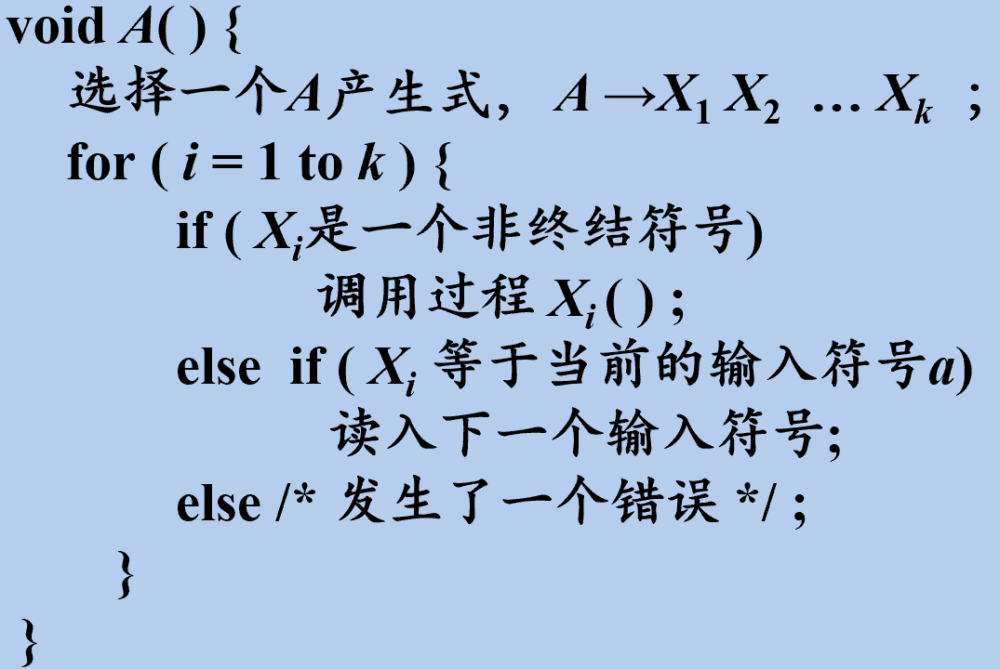

## 概述

从分析树的顶部（根节点）向底部（叶节点）方向构造分析树

可以看成是**从文法开始符号S推导出词串w的过程**

每一步推导中，都需要做两个选择：

- 替换当前句型中的哪个**非终结符**
- 用该非终结符的哪个**候选式**进行替换

==自顶向下分析采用**最左推导**，总是选择每个句型的**最左非终结符**进行替换==

根据输入流中的下一个终结符，选择最左非终结符的一个候选式

## 自顶向下分析通用形式

{width=50%}

- 由一组过程组成，每个过程对应一个**非终结符**
- 从文法**开始符号S**对应的过程开始，**递归调用**文法中其它非终结符对应的过程。如果S对应的过程体**恰好扫描了整个输入串**，则成功完成语法分析

> 缺点是可能需要**回溯**，导致效率降低

## 预测分析 (Predictive Parsing)

- 预测分析是**递归下降分析技术**的一个**特例**，通过在输入中向前看固定个数（通常是一个）符号来选择正确的A-产生式。
- 可以对某些文法构造出向前看k个输入符号的预测分析器，该类文法有时也称为**LL(k) 文法类** 

> LL(k)中的第一个L指的是从左向右扫描，第二个L指的是使用最左推导