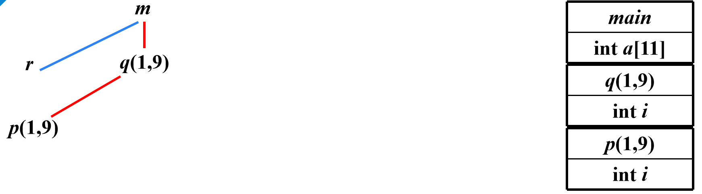
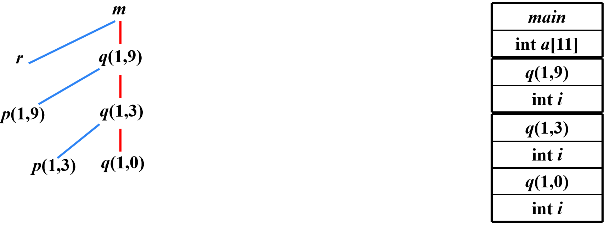
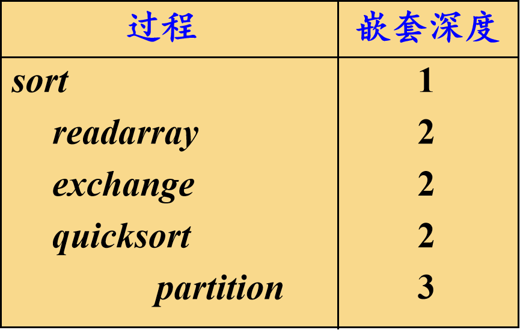

## 运行存储分配策略

编译器在工作过程中，必须为源程序中出现的一些数据对象分配运行时的存储空间

对于那些在编译时刻就**可以确定大小及存放位置**的数据对象，可以在编译时刻就为它们分配存储空间，这样的分配策略称为**静态存储分配**

反之，如果不能在编译时完全确定数据对象的大小或存放位置，就要采用**动态存储分配**的策略。动态分配策略又分为**栈式存储分配**和**堆式存储分配**

{width=300}

> 运行时的内存划分

例：

```c
int arr[2] = {1,2};
int main(){
    int a, b, c;
    c = add(a,b);
    char* str;
    str = (char*)malloc(c);
    strcpy(str,"do nothing");
    return 0;
}
int add(int x, int y){
    int z = x + y;
    return z;
}

```

- 静态数据区: `arr`,
- stack: `a`,`b`,`c`,`z`,`x`,`y`,`str`
- heap: `malloc`

### 活动记录

使用过程(或函数、方法)作为用户自定义动作的单元的语言，其编译器通常以过程为单位分配存储空间

## 静态存储分配策略

适合静态存储分配的语言必须满足：

1. 数组上下界必须确定
2. 不允许过程的**递归调用**
3. 不允许动态建立数据实体

> 对于2条件，递归的深度无法确定（例如斐波拉契数列的递归实现，不同的参数会导致不同的递归深度）

### 常用方法

1. 顺序分配法

按照过程**出现的先后顺序**逐段分配存储空间

各过程的活动记录占用**互不相交**的存储空间 

{width=300}

|过程|存储区域|
|-|-|
|1|0~21|
|2|22~36|
|3|37~54|
|4|55~71|
|5|72~94|
|6|95~104|

优点：处理上简单

缺点：对内存的空间使用不够经济合理

2. 层次分配法

通过对过程间的调用关系进行分析，凡属无相互调用关系的并列过程，尽量使其局部数据共享存储空间

{width=350}

|过程|存储区域|
|-|-|
|1|0~21|
|2|22~36|
|4|37~54|
|6|37~46|
|3|22~39|
|6|40~49|
|5|40~62|
|7|22~101|
|5|102~124|


## 栈式存储分配

当一个过程被调用时，该过程的**活动记录被压入栈**；当过程结束时，该活动记录**被弹出栈**

这种安排不仅允许活跃时段不交叠的多个过程调用之间共享空间，而且允许以如下方式为一个过程编译代码：它的非局部变量的相对地址总是固定的，和过程调用序列无关

### 活动树

用来描述程序运行期间控制进入和离开各个活动的情况的树称为活动树

树中的**每个结点对应于一个活动**。根结点是启动程序执行的`main`过程的活动

在表示过程p的某个活动的结点上，其子结点对应于被p的这次活动调用的各个过程的活动。按照这些活动被调用的顺序，**自左向右**地显示它们。一个子结点必须在其右兄弟结点的活动开始之前结束

例：快速排序







## 调用序列和返回序列

过程调用和过程返回都需要执行一些代码来管理活动记录栈，保存或恢复机器状态等

- 调用序列
    - 实现过程调用的代码段。为一个活动记录在栈中分配空间，并在此记录的字段中填写信息
- 返回序列
    - 恢复机器状态，使得调用过程能够在调用结束之后继续执行

### 调用序列

调用者计算实际参数的值

调用者将返回地址（程序计数器的值）放到被调用者的机器状态字段中。将原来的top-sp值放到被调用者的控制链中。然后，增加top-sp的值，使其指向被调用者局部数据开始的位置

被调用者保存寄存器值和其它状态信息

被调用者初始化其局部数据并开始执行

### 返回序列

被调用者将返回值放到与参数相邻的位置

使用机器状态字段中的信息，被调用者恢复top-sp和其它寄存器，然后跳转到由调用者放在机器状态字段中的返回地址

尽管top-sp已经被减小，但调用者仍然知道返回值相对于当前top-sp值的位置。因此，调用者可以使用那个返回值

## 非局部数据的访问

一个过程除了可以使用过程自身定义的局部数据以外，还可以使用过程外定义的**非局部数据**

语言可以分为两种类型

- 支持**过程嵌套声明**的语言
    - 可以在一个过程中声明另一个过程，例: Pascal
- 不支持过程嵌套声明的语言
    - 不可以在一个过程中声明另一个过程，例：C

### 有过程嵌套声明的数据访问

- 嵌套深度
    - 过程的嵌套深度
        - 不内嵌在任何其他过程中的过程，设其嵌套深度为1
        - 如果一个过程p在一个嵌套深度为i的过程中定义，则设定p的嵌套深度为i +1
    - 变量的嵌套深度
        - 将变量声明所在过程的嵌套深度作为该变量的嵌套深度

例：

```pascal
program sort ( input, output );
	var a: array[0..10] of integer; 
           x: integer;
   	procedure readarray;
		var i: integer; 
		begin … a … end {readarray} ；
	procedure exchange(i, j:integer);
		begin x=a[i];a[i]=a[j];a[j]=x; end {exchange} ；
	procedure quicksort(m, n:integer);
		var k, v : integer;
		function partition(y, z:integer):integer;
			var i, j : integer;
			begin … a … v … exchange(i, j) … end {partition};
		begin … a … v … partition … quicksort … end {quicksort} ；
	begin … a … readarray … quicksort … end {sort}；

```

{width=300}

### 访问链

**静态作用域规则**：只要过程b的声明嵌套在过程a的声明中，过程b就可以访问过程a中声明的对象

可以在相互嵌套的过程的活动记录之间建立一种称为**访问链**(Access link)的指针，使得内嵌的过程可以访问外层过程中声明的对象

如果过程b在源代码中**直接嵌套**在过程a中(b的嵌套深度比a的嵌套深度多1)，那么b的任何活动中的访问链都指向**最近的a的活动**

例：快速排序

```pascal
program sort ( input, output );
	var a: array[0..10] of integer; 
           x: integer;
   	procedure readarray;
		var i: integer; 
		begin … a … end {readarray} ；
	procedure exchange(i, j:integer);
		begin x=a[i];a[i]=a[j];a[j]=x; end {exchange} ；
	procedure quicksort(m, n:integer);
		var k, v : integer;
		function partition(y, z:integer):integer;
			var i, j : integer;
			begin … a … v … exchange(i, j) … end {partition};
		begin … a … v … partition … quicksort … end {quicksort} ；
	begin … a … readarray … quicksort … end {sort}；
```

{width=400}

{width=400}

`readarray`函数嵌套在sort函数中，指向最近的一次sort

{width=400}

`exchange`函数嵌套在sort函数中，指向最近的一次sort

### 访问链的建立

建立访问链的代码属于调用序列的一部分

假设嵌套深度为$n_x$的过程$x$调用嵌套深度为$n_y$的过程$y$ $(x→y)$

1. $n_x < n_y$的情况(外层调用内层)
       - y一定是直接在x中定义的 (例如：s→q,  q→p) ，因此，$n_y=n_x +1$
       - 在调用代码序列中增加一个步骤：在y的访问链中放置一个指向x的活动记录的指针
