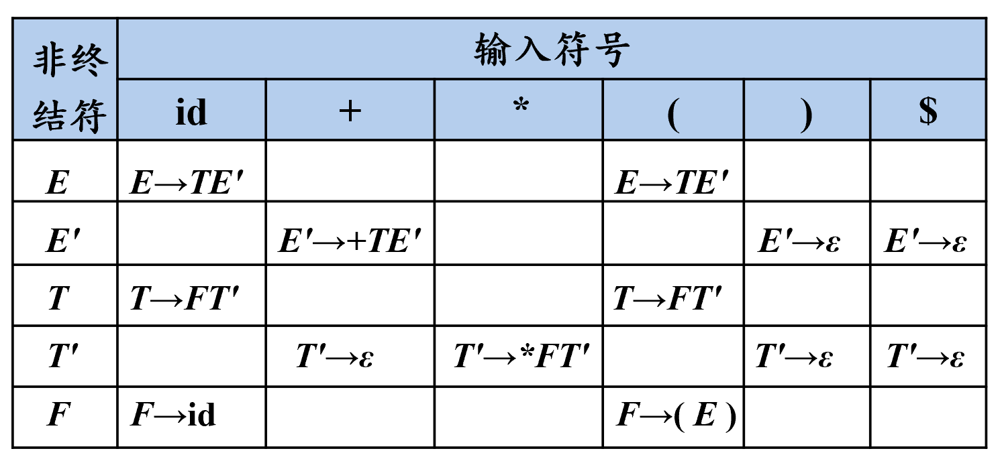

## 非递归的预测分析法

非递归的预测分析不需要为每个非终结符编写递归下降过程，而是根据预测分析表构造一个自动机，也叫表驱动的预测分析

输入：一个串w和文法G的分析表 M

输出：如果w在L(G)中，输出w的最左推导；否则给出错误指示

方法：最初，语法分析器的格局是：输入缓冲区中是w$\$$，G的开始符号位于栈顶，其下面是$\$$

### 示例

给出下列预测分析表



具体分析过程如下：

{width=60%}

## 递归的预测分析法

递归的预测分析法是指：在**递归下降分析**中，根据预测分析表进行产生式的选择

根据每个非终结符的产生式和LL(1)文法的预测分析表，为每个非终结符编写对应的过程

例：给出下列产生式

```
(1) <PROGRAM> → program <DECLIST> :<TYPE> ; <STLIST> end
(2) <DECLIST> → id <DECLISTN>
(3) <DECLISTN> → , id <DECLISTN>
(4) <DECLISTN> → ε
(5) <STLIST> → s <STLISTN>
(6) <STLISTN> → ; s <STLISTN>
(7) <STLISTN> → ε
(8) <TYPE> → real
(9) <TYPE> → int
```

```
program DESCENT;
	begin
        GETNEXT(TOKEN);
        PROGRAM(TOKEN);
        GETNEXT(TOKEN);
        if TOKEN≠’$’  then ERROR;
	end
```

为非终结符`PROGRAM`编写选择逻辑

```
procedure PROGRAM(TOKEN);
	begin
        if TOKEN≠’program’  then ERROR;
        
        GETNEXT(TOKEN);
        DECLIST(TOKEN);
        
        if TOKEN≠’:’  then ERROR;
        
        GETNEXT(TOKEN);
        TYPE(TOKEN);
        
        GETNEXT(TOKEN);
        if TOKEN≠’;’  then ERROR;
        
        GETNEXT(TOKEN);
        STLIST(TOKEN);
        
        if TOKEN≠’end’  then ERROR;
	end	 	
```